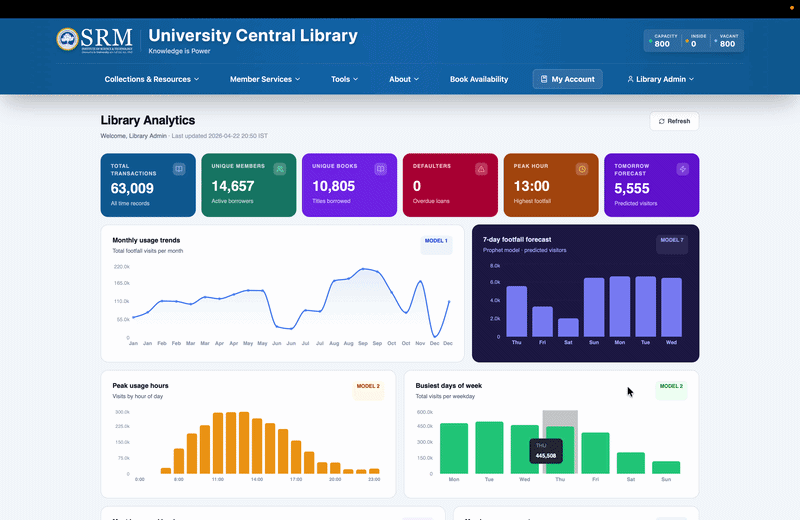
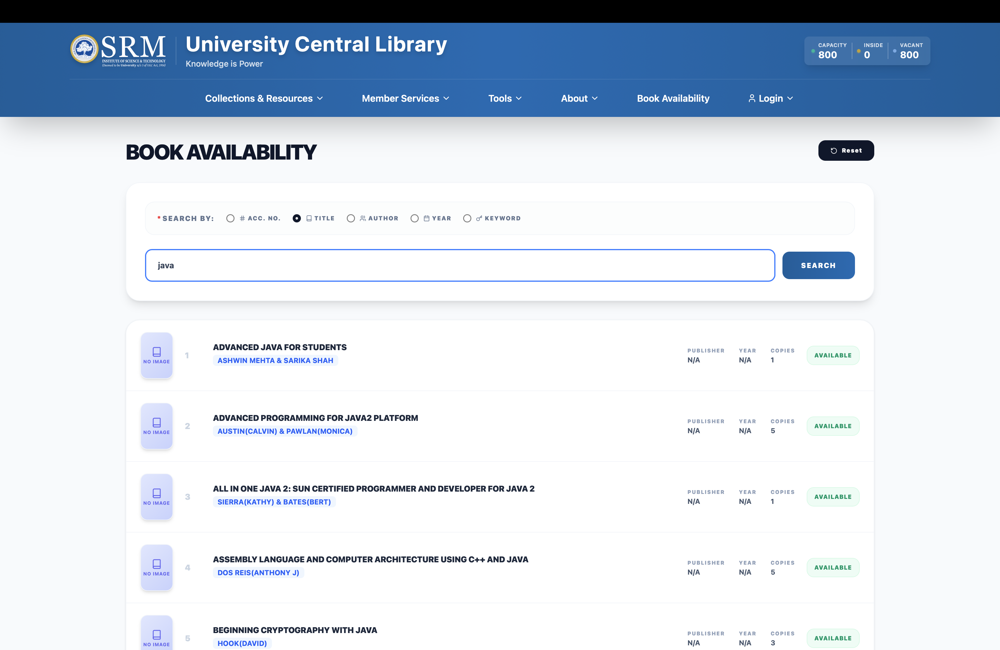
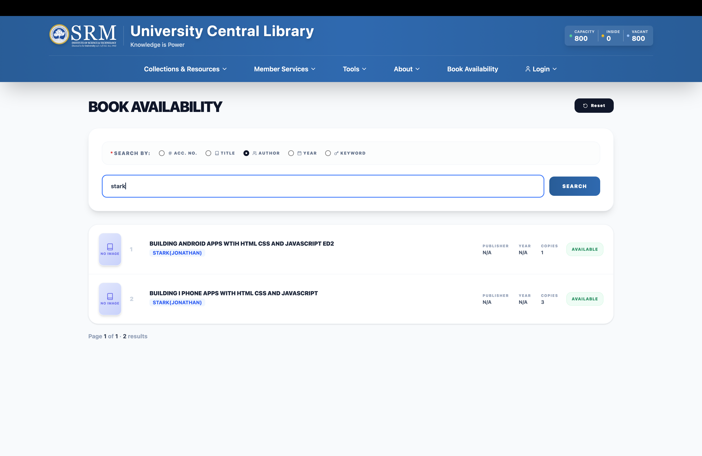
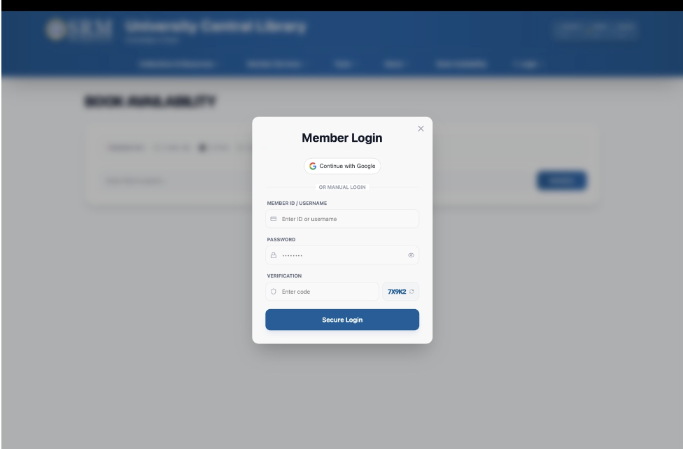
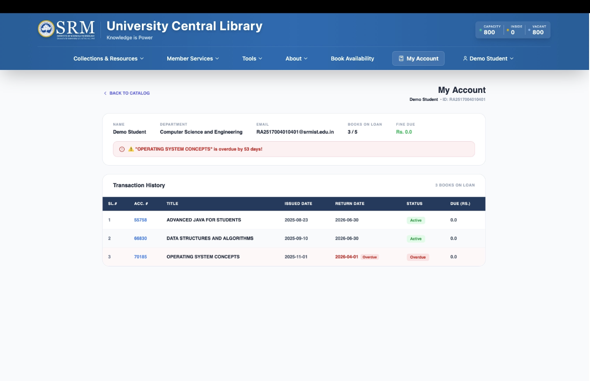

# Campus Library Usage Analytics & Dashboard System
**SRM Institute of Science and Technology, Kattankulathur**

> This repository documents the analytics and backend work done for the University Central Library. Due to institutional data privacy policies and university regulations, **the source code cannot be shared publicly.** This README covers the methodology, models, and system design.

---

## Team

**Backend, Analytics & Data Engineering** — Pranauv Skandhan

**Frontend & UI** — [Niya Giju](https://github.com/niyagiju)

Supervised by **Dr. G. Niranjana**, Head of Department, Computing Technologies, SRMIST.

The frontend was built entirely by Niya Giju. This repository specifically covers the backend and analytics work.

The system has been handed over to the **SRM University IT Department** for production deployment.

---

## What This Project Does

The SRM University Central Library had no analytical layer over its data. Every book borrowed, every student walking through the turnstile, and every seat occupied was being logged — but none of it was being used for decisions.

This project builds the analytics engine and backend API that sits between the library's raw data and a staff-facing dashboard and member portal. It processes millions of records across ten analytical models, serves everything through a REST API, and is designed so the library's IT team can plug in their live API endpoints and have the entire system running without touching any application logic.

---

## Data

The system was built against institutional data provided directly by the library:

| Source | Description |
|--------|-------------|
| Transaction records | Book borrowing events — member ID, book title, subject, issue date, return date |
| Footfall punch records | Turnstile entry/exit logs with timestamps — over 2.5 million entries |
| Book catalogue | ISBN, title, author, publisher, copy count, accession number |

Data spans **December 2023 to October 2025**. All analysis was done in Jupyter notebooks before being productionised into the backend.

---

## Exploratory Data Analysis

Before building any model, the data was explored across approximately nine Jupyter notebooks covering:

- Data cleaning — date parsing, null handling, column standardisation, duplicate detection
- Monthly checkout trends — identifying seasonal peaks aligned to the academic calendar
- Subject distribution — Computer Science leads at 10,200+ borrows; top 5 subjects account for ~55% of all checkouts
- Day-of-week patterns — Monday is the peak borrowing day, Sunday the lowest
- Hour-of-day patterns — 13:00 is the peak library hour
- Member behaviour — top borrower analysis, engagement tier distribution
- Defaulter concentration — which subjects and members have the most overdue loans
- Demand heatmap — subject × month visualisation revealing period-specific demand spikes
- Prophet forecast validation — model fit against held-out historical months

---

## Analytics Models

### Core Analytics

**Model 1 — Library Usage Trends**
Aggregates footfall records at monthly granularity to produce a time series of total library visits. Resampled using `pandas resample("ME")`. Output feeds the monthly trend area chart on the staff dashboard.

**Model 2 — Peak Hours & Busiest Days**
Breaks down footfall by hour of day (`dt.hour`) and day of week (`dt.dayofweek`) to identify when the library sees the most traffic. Informs staffing decisions and maintenance scheduling.

**Model 3 — Popular Books & Subjects Tracker**
Groups transaction records by book title and subject category, extracting the top 10 in each. Author and ISBN metadata are joined from the catalogue for cover image retrieval via the OpenLibrary API.

**Model 4 — Borrow Duration & Circulation Velocity**
Computes average loan duration per book as `(return_date - issue_date).dt.days` across completed transactions. Fast-moving books with short averages indicate high turnover; slow-moving ones flag potential weeding candidates.

**Model 5 — Student Engagement Profile**
Classifies every member into engagement tiers based on total borrow count: High (10+), Mid (5–9), Low (<5). Also identifies each member's dominant subject by most borrows. 14,657 unique members profiled across the dataset.

### Forecasting Models

**Model 6 — Library Footfall Forecast (Prophet)**
Uses Facebook Prophet to predict the next 7 days of daily visitor counts from the footfall time series. Prophet was chosen over ARIMA because it handles the multiple seasonality in this data (weekly + yearly academic calendar cycles) without manual stationarity transformations, and it is robust to gaps in the footfall data during institutional closures. Configuration: `weekly_seasonality=True`, `yearly_seasonality=True`, `changepoint_prior_scale=0.05`.

**Model 7 — Book Checkout Demand Forecast (Prophet)**
Applies the same Prophet setup to the daily checkout count series. Kept separate from the footfall forecast because physical visits and borrowing demand move independently — students visit for study space without borrowing, and checkout demand reflects curriculum pressure differently from physical occupancy.

### Recommendation & Association

**Model 8 — Subject-Based Recommendation Engine**
For each subject, identifies the top 5 books borrowed by members who also borrow from that subject. A co-occurrence approach — no matrix decomposition required. Powers the "You might also like" sidebar on the Book Availability page.

**Model 9 — Cross-Subject Association Analysis**
Finds which subject pairs are most frequently co-borrowed by the same student using `itertools.combinations` over each member's subject set, tallied across all members and filtered by a minimum support threshold. Top result: Computer Science ↔ Mathematics with 804 co-borrowers. Pairwise-only approach instead of full Apriori — computationally efficient and directly actionable for collection displays and cross-disciplinary recommendations.

### Defaulters Detection
Identifies active loans where the return date is null and the loan has been outstanding for more than 14 days. Surfaces individual defaulters and subject-level defaulter concentration for librarian follow-up. Exported as a downloadable CSV from the dashboard.

---

## Backend Architecture

Built with **Python FastAPI**, served by Uvicorn. All analytics models run in a standalone script that reads from the university's live API endpoints and writes a single JSON output file. The dashboard reads from this file. A refresh endpoint triggers the analytics engine as a `BackgroundTask`, so the server never blocks during model recomputation.

Every endpoint tries the live institutional API first. If it is unavailable, the endpoint returns a sensible fallback — local catalogue data for book search, zero-fill for seat count, cached analytics for the dashboard. The platform stays functional regardless of API availability.

### API Endpoints

| Endpoint | Method | Description |
|----------|--------|-------------|
| `/api/auth/signin` | POST | Member authentication, role determination |
| `/api/stats` | GET | Serve analytics output to dashboard |
| `/api/refresh-stats` | POST | Trigger analytics recomputation |
| `/api/seat-count` | GET | Live seat occupancy from turnstile API |
| `/api/user-details/{id}` | GET | Member role lookup |
| `/api/patron/staff/{id}` | GET | Staff membership and loan data |
| `/api/patron/student/{id}` | GET | Student membership and transaction history |
| `/api/book/search` | POST | Book catalogue search |
| `/api/book/search/details` | POST | Book availability details |

### Configuration Design

The entire system is activated for production by editing **one file** — `config.py`:

```python
BASE_URL     = "https://library.srmist.edu.in"   # university library server
BEARER_TOKEN = "actual_token_here"                # API authentication key
```

All nine API endpoints are constructed automatically from `BASE_URL`. The bearer token is injected into every outbound request header. No other file needs to be touched.

---

## Demo


### Staff Analytics Dashboard



The dashboard shows live analytics across all 9 models — monthly trends, Prophet forecast, peak hours, most borrowed books, member engagement tiers, cross-subject associations, defaulter count, and downloadable CSV reports. The Refresh button re-runs the full analytics engine in the background and updates all charts automatically.


### Book Availability Search

Search by title:



Search by author:



Results show availability status, copy count, publisher, year, and ISBN-linked cover images fetched from OpenLibrary. Pagination handles large result sets with windowed page numbers.

### Login Page



### My Account page



---

## Tech Stack

| Layer | Technology |
|-------|------------|
| Backend | Python, FastAPI, Uvicorn |
| Analytics | Pandas, Facebook Prophet, itertools |
| Data exploration | Jupyter Notebooks, Matplotlib, Seaborn |
| Frontend | React 18, Vite, Tailwind CSS, Recharts |
| Auth | Google OAuth 2.0, JWT |
| Book covers | OpenLibrary Covers API |

---

## Status

Completed April 2026. Handed over to the SRM University IT Department for production deployment with live API endpoints.

